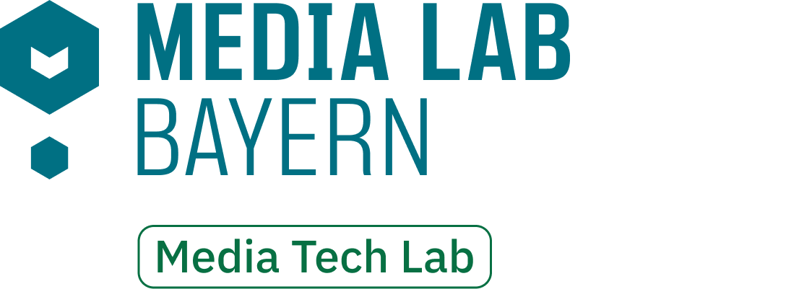

<br />
<div align="center">
  <a href="https://github.com/tsterbak/promptmage">
    
  </a>

  <h1 align="center">PromptMage</h1>

  <p align="center">
    simplifies the process of creating and managing LLM workflows as a self-hosted solution.
  </p>
</div>

## About the Project

"PromptMage" is designed to offer an intuitive interface that simplifies the process of creating and managing LLM workflows as a self-hosted solution. It facilitates prompt testing and comparison, and it incorporates version control features to help users track the development of their prompts. Suitable for both small teams and large enterprises, "PromptMage" seeks to improve productivity and foster the practical use of LLM technology.

The approach with "PromptMage" is to provide a pragmatic solution that bridges the current gap in LLM workflow management. We aim to empower developers, researchers, and organizations by making LLM technology more accessible and manageable, thereby supporting the next wave of AI innovations.

## Philosophy
- Prompts as first-class citizens
- Type-hint everything for automatic inference and validation magic
- build-in, automatically created API with fastAPI for easy integration

## Getting Started

### Installation

To install promptmage, run the following command:

```bash
pip install promptmage 
```

## Usage

To use promptmage, run the following command:

```bash
promptmage cast <path-to-flow>
```

## Roadmap

Coming soon.


## Development

To develop PromptMage, check out the [DEVELOPMENT.md](DEVELOPMENT.md) file.

## Contributing

Contributing

We welcome contributions from the community! If you're interested in improving PromptMage, you can contribute in the following ways:

* **Reporting Bugs**: Submit an issue in our repository, providing a detailed description of the problem and steps to reproduce it.
* **Feature Requests**: Have ideas on how to make FlowForge better? We'd love to hear from you! Please submit an issue, detailing your suggestions.
* **Pull Requests**: Contributions via pull requests are highly appreciated. Please ensure your code adheres to the coding standards of the project, and submit a pull request with a clear description of your changes.


## License

This project is licensed under the MIT License - see the [LICENSE.md](LICENSE.md) file for details.

## Contact
For any inquiries or further information, feel free to reach out at [promptmage@tobiassterbak.com](mailto:promptmage@tobiassterbak.com).

## ❤️ Acknowledgements

This project was supported by

<a href="https://www.media-lab.de/en/programs/media-tech-lab">
    
</a>