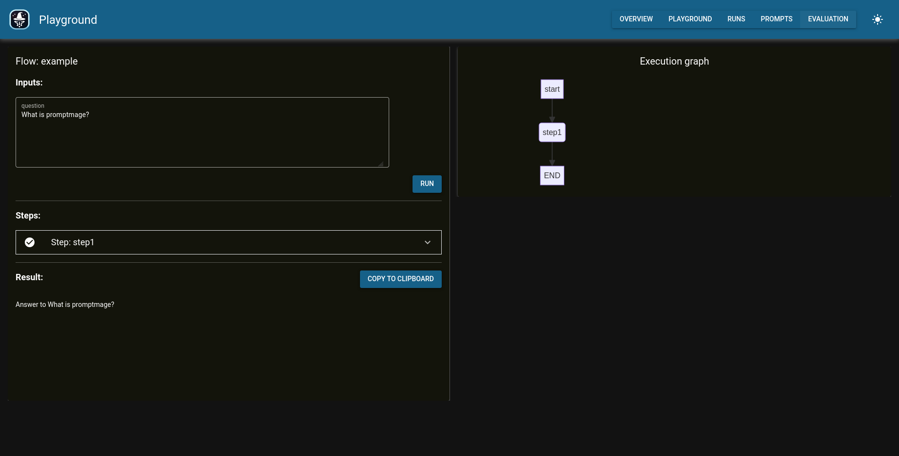
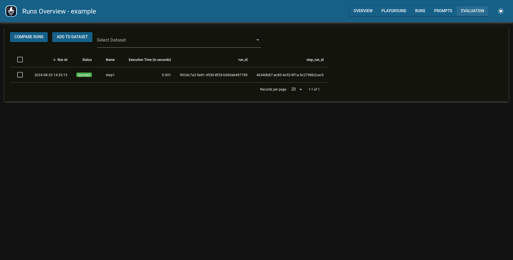

# Getting Started

## Installation

To install promptmage, run the following command:

```bash
pip install promptmage 
```

## Annotated Code Example

Here is an example of how to use promptmage in your application:

``` python
from promptmage import PromptMage, Prompt, MageResult

# Create a new promptmage instance
mage = PromptMage(#(1)!
    name="example",#(2)!
)
```

1.  The [`PromptMage`](/reference/#promptmage) class is the main class of promptmage. It is used store all the information about the flow and to run the flow.
2.  The `name` parameter is used to give the promptmage instance a unique name. This allows to run multiple promptmage instances in parallel.

Steps are the building blocks of a flow. They are used to define the different parts of the flow and to connect them together. A step is just a python function with the [`@mage.step()`](/reference/#promptmagestep) decorator which returns a [`MageResult`](/reference/#mageresult). Here is an example of how to create a step:

``` python
@mage.step(
    name="step1", #(1)!
    prompt_name="prompt1", #(2)!
    initial=True #(3)!
)
def step1(question: str, prompt: Prompt) -> MageResult: #(4)!
    response = client.chat.completions.create( #(5)!
        model="gpt-4o-mini",
        messages=[
            {"role": "system", "content": prompt.system},
            {
                "role": "user",
                "content": prompt.user.format(question=question),
            },
        ],
    )
    answer = response.choices[0].message.content
    return MageResult(
        next_step=None, #(6)!
        result=answer
    )
```

1.  The `name` parameter is used to give the step a unique name.
2.  The `prompt_name` parameter is used to specify the name of the prompt that should be used for this step.
3.  The `initial` parameter is used to specify if this is the initial step of the flow.
4.  The `step1` function is a step that takes a question and a prompt as input and returns a [`MageResult`](/reference/#mageresult) with the result of the step and the name of the next step to run. The prompt is managed by the promptmage instance and is automatically passed to the step.
5. The step uses the OpenAI API to generate a response to the question using the prompt.
6.  The `next_step` parameter is used to specify the name of the next step to run. If `None` is returned, the flow will stop.


## Usage

Put the above code in a file called `flow.py` and setup the OpenAI client. To run the flow with promptmage, run the following command:

```bash
promptmage run flow.py
```

This will start the promptmage server and run the flow at the given path. You can now access the promptmage interface at `http://localhost:8000/gui/`.

## Usage with a remote backend server

For a production setup and collaborative usage with teams you can run the promptmage server with a remote backend. To run the remote backend on a remote server, run the following command:

```bash
promptmage serve --port 8021
```

To connect your promptmage script to the remote backend, you need to add the `remote` url to the PromptMage instance of your script:

```python
mage = PromptMage(
  name="example",
  remote="http://localhost:8021" #(1)!
)
```

Now you can run your script and the promptmage server will use the remote backend to run the flow and store the results.

1. The `remote` parameter is used to specify the URL of the remote backend to use. If this is set, the `PromptMage` instance will use the remote backend instead of the local one.


## GUI walkthrough

The promptmage interface is divided into four main sections: the flow playground, the run history, the prompt repository, and the evaluation section.

### Flow playground

<figure markdown="span">
  { width="70%" }
  <figcaption>Initial flow playground for the example flow.</figcaption>
</figure>

<figure markdown="span">
  { width="70%" }
  <figcaption>Edit the step prompt of step 1.</figcaption>
</figure>

<figure markdown="span">
  { width="70%" }
  <figcaption>After the run you can see the execution graph and the results.</figcaption>
</figure>

### Run history

<figure markdown="span">
  { width="70%" }
  <figcaption>Here you can see all your runs and the results.</figcaption>
</figure>

<figure markdown="span">
  { width="70%" }
  <figcaption>By clicking on a run, you can look at the details.</figcaption>
</figure>

### Prompt repository

<figure markdown="span">
  { width="70%" }
  <figcaption>You can see all your prompts and versions in the prompts repository.</figcaption>
</figure>


## More examples

Have a look at the examples in the [examples](https://github.com/tsterbak/promptmage/tree/main/examples) folder to see how to use promptmage in your application or workflow.

### Use with Docker

You can find an usage example with docker here: [Docker example](https://github.com/tsterbak/promptmage/tree/main/examples/docker).
