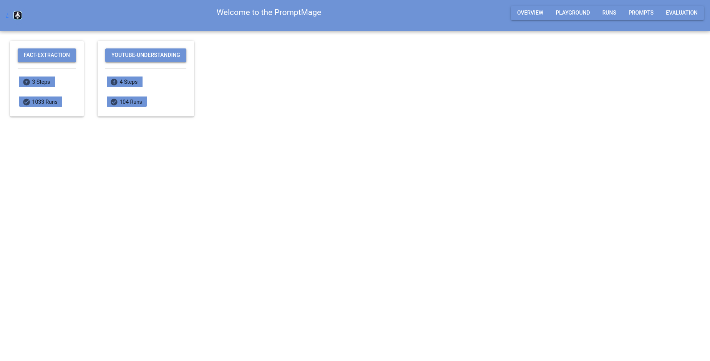
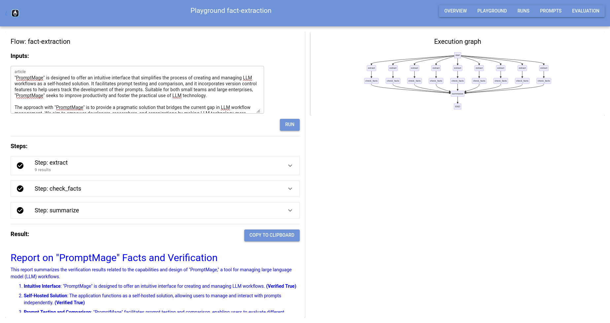
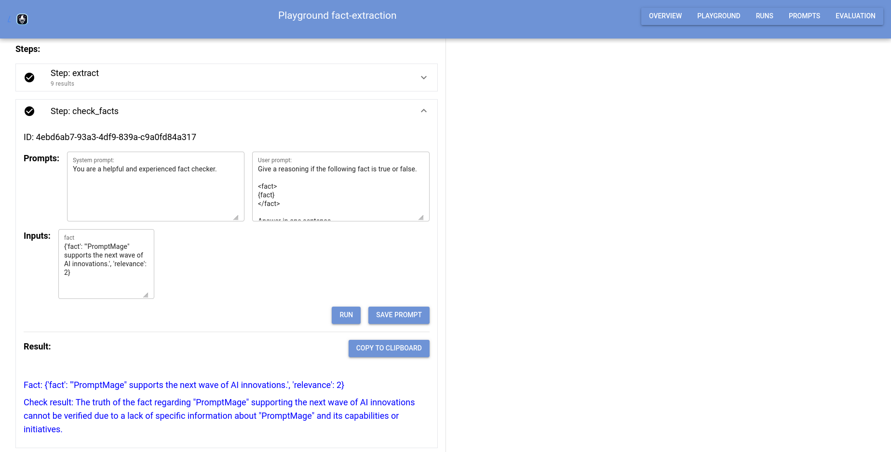
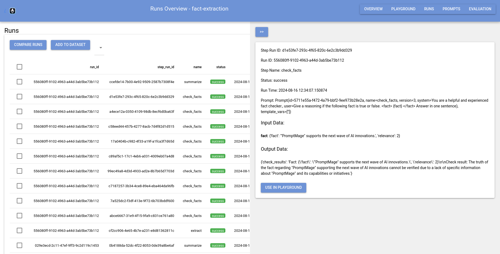
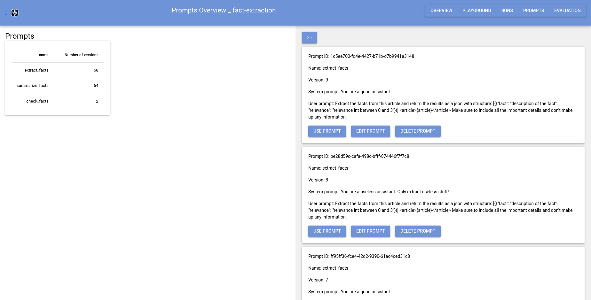

# Walkthrough

## Launching the application

After you installed promptmage and added it to your project following the [tutorial](tutorial.md), you can now run the application and interact with it in the web UI.

To run the application, you can use the following command:

```bash
promptmage run summarizer.py
```

This will start the promptmage server and run the application at the given path.

## Accessing the API

PromptMage automatically creates an API for your application using FastAPI. You can access the API at `http://localhost:8000/api/` and the Swagger documentation at `http://localhost:8000/docs/`.


You can use the API to interact with your application programmatically or integrate it into other services.

## Interacting with the web UI

You can access the web UI at `http://localhost:8000/gui/`. Here you can interact with the prompts and see the output of the steps.

### Application Overview

The application overview shows all available flows.



### Flow Overview

The flow overview shows all steps of the flow and their status as well as an execution graph for the flow once executed.



### Step interaction

You can interact with the steps by clicking on them. This will expand the step and show the prompts and the output of the step.
This also allows you to manually run the step and tweak the input and prompts.




## Runs page

The runs page shows all runs of the application and allows you to see the output of the steps for each run.



You can also replay runs to see the output of the steps and the prompts that were used during the run.

## Prompt repository

The prompt repository allows you to manage your prompts. You can create new prompt versions, edit existing prompts, and delete prompts. You can also see the history of a prompt and see which runs used the prompt.




## Conclusion

This concludes the walkthrough of PromptMage. You have seen how to install and use PromptMage, how to create a simple application, and how to interact with the web UI. You can now integrate PromptMage into your workflow and use it to build and test your applications faster and more efficiently.